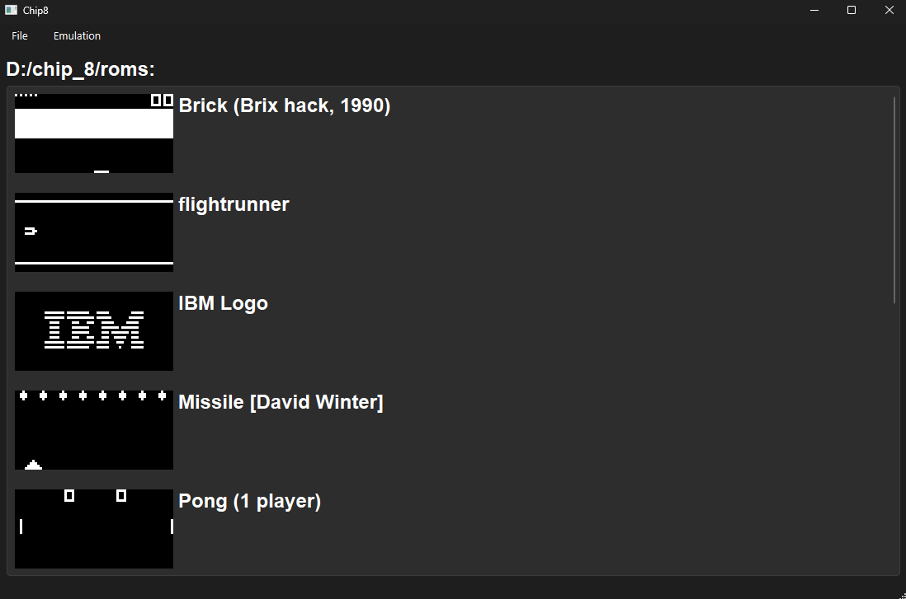
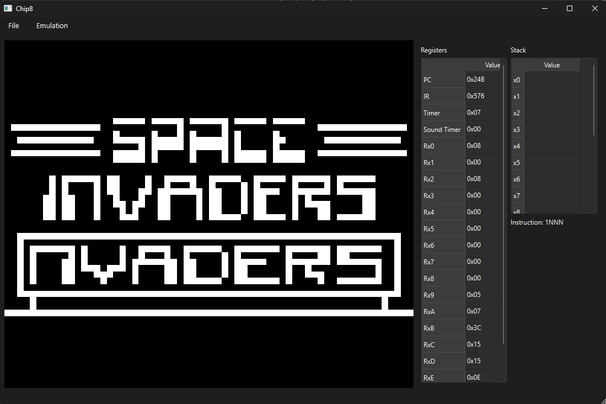
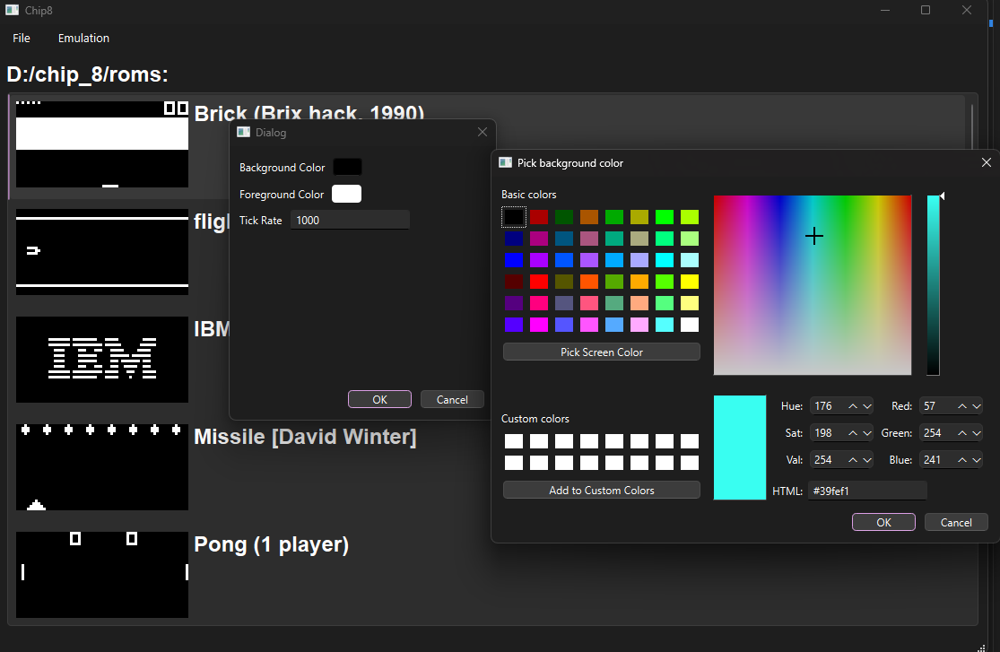
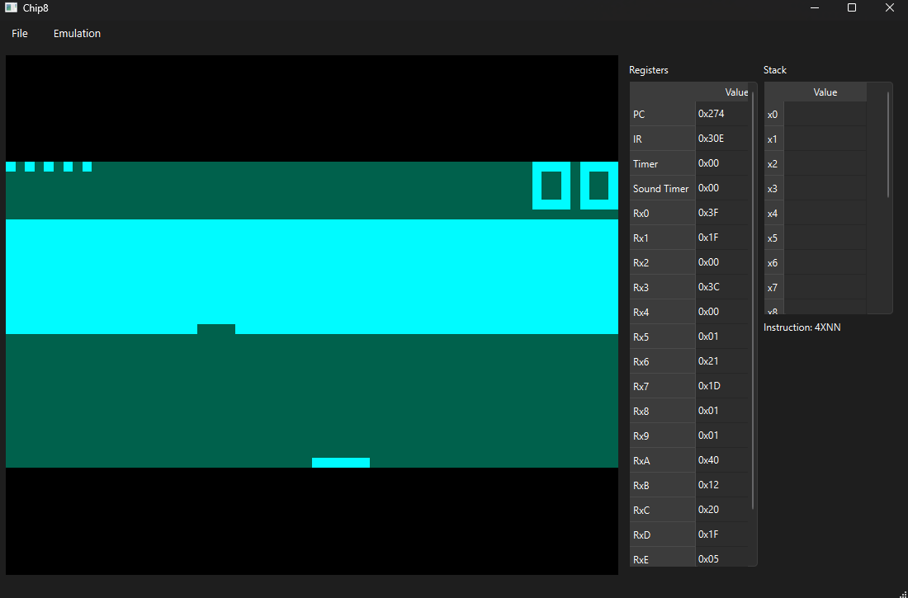
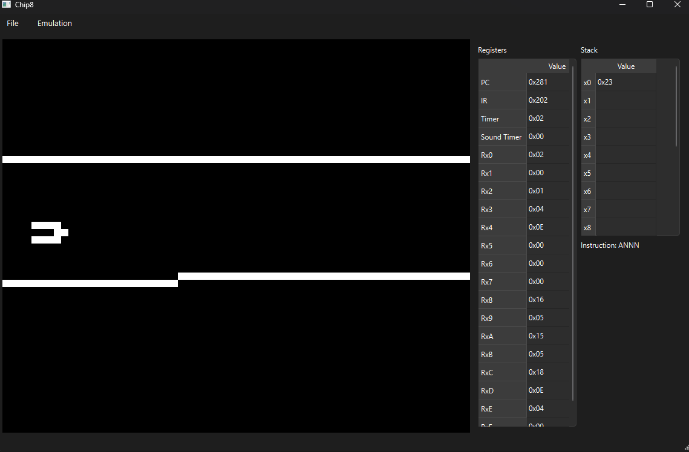

# Chip‑8 Emulator

A cross‑platform Chip‑8 emulator built with **Qt 6** for its GUI. It runs natively on **Windows and Linux**, and is designed for accurate emulation, teaching, and casual retro‑gaming.

<div align="center">
  
  <br/><em>ROM List</em>
</div>  
<div align="center">
  
  <br/><em>Space Invaders</em>
</div>  

## Demo
[](https://github.com/user-attachments/assets/0297dfab-5965-4233-93a5-d43d95bf565f)

## Table of Contents

- [Chip‑8 Emulator](#chip8-emulator)
  - [Demo](#demo)
  - [Table of Contents](#table-of-contents)
  - [Features](#features)
  - [Quick Start](#quick-start)
  - [Building from Source](#building-from-source)
    - [Prerequisites](#prerequisites)
  - [Configuration](#configuration)
  - [Debugging Facilities](#debugging-facilities)
  - [Dependencies](#dependencies)

---

## Features

* **Graphical ROM Browser** – Point the emulator at a directory of ROM files (`.ch8` or `.c8`) and a launch list is generated automatically.
* **Per‑ROM & Global Profiles** – Persist background/foreground colours (Chip‑8 is monochrome) and the master tick rate, either globally or for a single ROM.
* **Pause / Resume Execution** – Suspend and resume the virtual machine without losing state.
* **Real‑time Debug Panel** – Live view of registers, stack, timers, program counter, and the instruction currently being executed.
* **Automatic Thumbnails** – The first meaningful frame is captured and cached, giving each ROM a visual identity instead of a bare filename.

---

## Quick Start

1. **Download the latest release** from the Releases page.
2. **Launch the executable** and choose a folder containing Chip‑8 ROMs (`*.ch8` or `*.c8`).
3. **Double‑click a ROM** to start running.

---

## Building from Source

### Prerequisites

* C++17 compiler
* [Qt 6](https://www.qt.io/) (Widgets module)
* CMake 3.16+

```bash
git clone https://github.com/BashirAbu/chip8.git
cd chip8
mkdir build
cd build
cmake .. -DCMAKE_BUILD_TYPE=Release -DQt_DIR=<path/to/qt/installation>
cmake --build . --config Release
```
---

## Configuration

All settings—global and per‑ROM—are edited through the **Settings** dialog. Global settings can be accessed via File -> Config menu. Per-ROM setting can be accessed through right-click on ROM, and choosing config from the context menu. No manual file editing is required; values are saved in the config folder in the executable directory.

Configurable fields include:

* Display foreground/background colours
* Emulator tick rate (Hz)
* Individual overrides per ROM


<div align="center">
  
  <br/><em>Config Dialog</em>
</div> 


<div align="center">
  
  <br/><em>Custom Colors</em>
</div> 

## Debugging Facilities

The **Debug** widget streams machine state every tick:

| Element     | Description                          |
| ----------- | ------------------------------------ |
| Registers   | V0–VF, I, DT, ST                     |
| PC / SP     | Program counter and stack pointer    |
| Stack view  | 16‑level call/return stack           |
| Instruction | Currently fetched and decoded opcode |

<div align="center">
  
  <br/><em>Debug UI</em>
</div

---

## Dependencies

* **Qt 6** – GUI framework (Widgets module).
* **GoogleTest** – Unit‑testing framework for automated validation.
